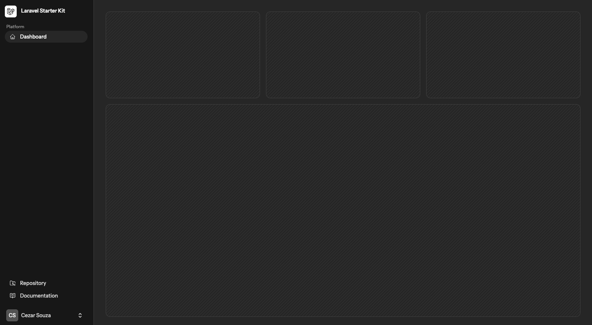
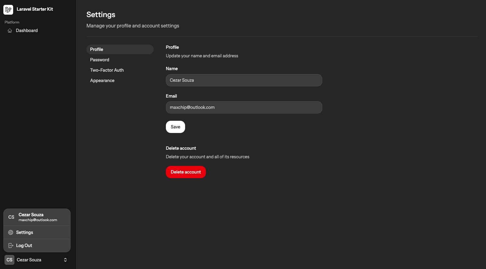

# Building a Project with Laravel

Responsive application layout with sidebars, multi-column layouts, stacked grids, navbars and more built with Laravel, Livewire, Flowbite, Flux UI, Tailwind CSS, Vite and SQLite.

# Core Features

- Register new user
- Login
- User Profile
- Autentication
- Forgot/Reset password
- Two-Factor Autentication
- Dark/Light Mode

# Commands

```
-- Create App

laravel new flowbite-app

Which starter kit would you like to install? Livewire
Which authentication provider do you prefer? Laravel's built-in authentication 
Would you like to use Laravel Volt? Yes
Which testing framework do you prefer? Pest
Do you want to install Laravel Boost to improve AI assisted coding? Yes

npm i -S flowbite

-- Copy files

./resources/css/app.css
.resources/views/components/layouts/app/sidebar.blade.php

-- Install Livewire

composer require livewire/livewire
php artisan livewire:publish --config

-- Run

composer run dev

```

# Web Interface

http://localhost:8000/dashboard




